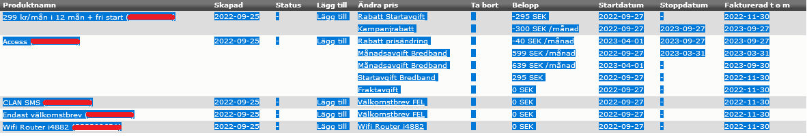

# product_detail_clarifier

1. Ladda ner zip-filen och öppna den.
2. Öppna därefter index.html med chrome.
3. Kopiera all information som du finner under produktdetaljer i ONE och klistra in i rutan.

5. Klicka på ADD
6. Totala månadskostnaden visas längst ner.
   
    Grön: Aktiv produkt med månadskostnad
    
    Ljusgrön: Aktiv produkt med fast kostnad
    
    Röd: Ej aktiv produkt (Är inte med i beräkningen av månadskostnad)
